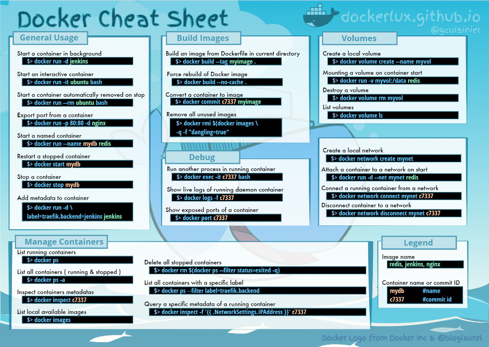

# Working with Dockers (Dockerfile, Images, Containers, and Networks)

Docker provides the ability to package and run an application in a loosely isolated environment called a container.
The isolation and security allows you to run many containers simultaneously on a given host. 
Containers are lightweight and contain everything needed to run the application, so you do not need to rely on what is currently installed on the host. 
You can easily share containers while you work, and be sure that everyone you share with gets the same container that works in the same way.

## Dockerfile reference
Docker can build images automatically by reading the instructions from a Dockerfile. A Dockerfile is a text document that contains all the commands a user could call on the command line to assemble an image. This page describes the commands you can use in a Dockerfile.

Docker runs instructions in a Dockerfile in order. A Dockerfile must begin with a FROM instruction. This may be after parser directives, comments, and globally scoped ARGs. The FROM instruction specifies the Parent Image from which you are building. FROM may only be preceded by one or more ARG instructions, which declare arguments that are used in FROM lines in the Dockerfile.

Docker treats lines that begin with # as a comment, unless the line is a valid parser directive. A # marker anywhere else in a line is treated as an argument. This allows statements like:

***********************************************************
DOCKERS --> Dokerfile (in the root) same place as requirements.txt

<pre>
FROM python:3.8                      < image >
FROM python
FROM ubuntu:latest
                                       
RUN pip install -r requirements.txt   < command > ["< executable >", "< param 1 >", "< param 2 >"] 
RUN pip install request pandas others....
RUN apt update
RUN apt install python3 -y

WORKDIR /fastapi-app                 < path to working directory >
WORKDIR c:\\windows\
WORKDIR D:/Users/...

ADD main.py .                        < source > < destination > 
ADD test1.txt c:\temp\               ["< source >", "< destination >"] -> destination includes white space

COPY requirements.txt .               (Libraries)
COPY ./app ./app                      < source > < destination >  
COPY config* c:/temp/                 ["< source >", "< destination >"] -> destination includes white space
COPY main.py ./

CMD ["python", "./app/main.py"]       < command >  ["< executable >", "< param >"]
CMD ["python3", "./main.py"]
CMD ["c:\\Apache24\\bin\\httpd.exe", "-w"]
</pre>
--------------------------------------------------------
# RUN = pull + create + start

```
docker pull python:3.9
```
      
```
docker pull python:latest
```
      
```
docker create --name <container_name> python:3.9
```
      
```
docker start <container_name>
```
      
```
docker run -it --name <container_name> python:3.9 /bin/bash
```

or case MySQL
```
docker run -it --name <container_name> -e MYSQL_ROOT_PASSWORD=root -d mysql/mysql -server:5.7 mysql
```
      
```
docker exec -it <container_name> /bin/bash
```
      
```
docker container stop <container_name>
```

## Getting Help

Display Docker version with docker --version
```
docker --version
```
(-v = --version)
```
docker -v
```

Display Docker system info with docker info
```
docker info
```
Get help on Docker with docker --help
```
docker --help
```

Get help on Docker command usage with docker {command} --help
```
docker run --help
```

(-t = --tty, -i = --interactive, -d = --detashed, -e = --env, -p = --publish, -rm = --remove after, -a = --all)

## Building Images

Docker images are a lightweight, standalone, executable package of software that includes everything needed to run an application:

code, runtime, system tools, system libraries and settings.

List local images
```
docker images
```

```
docker image ls
```

Build an Image from a Dockerfile
```
docker build -t <image_name> .
```

```
docker run -it <image_name> /bin/bash
```

```
python3 print.py
```

Hello World!
```
cat print.py
```
print('Hello World!')
```
exit
```

```
docker run <image_name>
```
Hello World!

### docker image history
```
docker image history [OPTIONS] IMAGE
```

### Build Images

Build an image with docker build {path}
```
docker build .
```

Build an Image from a Dockerfile
```
docker image build [OPTIONS] PATH | URL | -
```

```
docker build -t <image_name> .
```
To Update modifications run
```
docker run <image_name>
```

Build an Image from a Dockerfile without the cache
```
docker build -t <image_name> . –no-cache
```

Build an image from the Dockerfile in the current directory and tag the image
```
docker build -t myapp:1.0 .
```

Build a tagged image with docker build --tag {name:tag} {path}
```
docker build --tag myimage:2023-edition .
```

Build an image without using the cache docker build -no-cache {path}
```
docker build --no-cache .
```

## Image Management

List all local images with docker images
```
docker images
```

```
docker image ls
```

Show Docker disk usage with docker system df
```
docker system df
```

Show image creation steps from intermediate layers with docker history {image}
```
docker history alpine
```

```
docker history python
```

Save an image to a file with docker save --output {filename}
Usually combined with a compression tool like gzip
```
docker save julia | gzip > julia.tar.gz
```
Load an image from a file with docker load --input {filename}
```
docker load --input julia.tar.gz
```
Delete an image with docker rmi {image}
```
docker rmi <image_name>
```

```
docker rmi rocker/r-base
```
Delete an image from the local image store
```
docker rmi alpine:3.4
```
Remove all unused images
```
docker image prune
```

## Inspecting Containers

A container is a runtime instance of a docker image. A container will always run the same, regardless of the infrastructure.

Containers isolate software from its environment and ensure that it works uniformly despite differences for instance between development and staging.

To list currently running containers:
```
docker container ls
```

```
docker ps
```
List all docker containers (running and stopped):
```
docker ps --all
```

```
docker container ls --all
```

List all containers matching a conditions with docker ls --filter {key}={value}
```
docker container ls --filter 'name=red1'
```
Show container log output with docker logs --follow {container}
  --> Print current datetime
```
docker run --name bb busybox sh -c "$(echo date)"
```
   --> Print what bb container printed
```
docker logs --follow bb
```

Running docker stats on all running containers against a Linux daemon.
> docker stats [OPTIONS] [CONTAINER...]
```
docker stats
```

Running docker stats on container with name nginx and getting output in json format.
```
docker stats nginx --no-stream --format "{{ json . }}"
```

## Running Containers

Create and run a container from an image, with a custom name
```
docker run --name <container_name> <image_name>
```
Run a container with and publish a container’s port(s) to the host.
```
docker run -p <host_port>:<container_port> <image_name>
```
Run a container in the background
```
docker run -d <image_name>
```
Start or stop an existing container:
```
docker start|stop <container_name> (or <container-id>)
```
Remove a stopped container:
```
docker rm <container_name>
```
Open a shell inside a running container:
```
docker exec -it <container_name> sh
```
Fetch and follow the logs of a container:
```
docker logs -f <container_name>
```
To inspect a running container:
```
docker inspect <container_name> (or <container_id>)
```
View resource usage stats
```
docker container stats
```

  --> Runs a test container to check your installation works
Run a container with docker run {image}
```
docker run hello-world
```
Run a container then use it to run a command with docker run {image} {command}
  --> Run Python & print text
```
docker run python python -c "print('Python in Docker')"
```
--> Run R & print a model
```
docker run rocker/r-base r -e "print(lm(disc`speed, cars))" 
```
Run a container interactively with docker run --interactive --tty
--> Run R interactively
```
docker run --interactive --tty rocker/r-base  
```
Run a container, and remove it once you've finished with docker run --rm
 --> Run MySQL, then clean up
```
docker run --rm mysql
```
Run an image in the background with docker run --detach
```
docker run --detach postgres
```
Run an image, assigning a name, with docker --name {name} run
 --> Run redis, naming the container as red1
```
docker run --name red1 redis
```
Run an image as a user with docker run --user {username}
```
docker run --user doctordocker mongo
```

```
docker run
```
- --rm remove container automatically after it exits
- -it connect the container to terminal
- --name web name the container
- -p 5000:80 expose port 5000 externally and map to port 80
- -v ~/dev:/code create a host mapped volume inside the container
- alpine:3.4 the image from which the container is instantiated
- /bin/sh the command to run inside the container

Examples:
```
docker run --interactive --tty python:3.9
```
(-e = --environement, -d = --detach)
```
docker run --name <container_name> -d -e MYSQL_RANDOM_ROOT_PASSWORD=true -d mysql/mysql -server:5.7 mysql
```

```
docker container run --detach --name <container_name> -p 3306:3306 --env MYSQL_RANDOM_ROOT_PASSWORD=yes mysql
```

```
docker container logs db | grep PASSWORD
```

```
docker exec -it <container_name> /bin/bash
```

```
docker run --name <container_name> -e POSTGRES_PASSWORD=root -p 5432:5432 -d postgres
```

```
docker run -pp 27017:27017 --name <container_name> mongo
```

```
docker run -d -p 8800:80 <container_name> apache <image_name>
```


Stop a running container through SIGTERM
```
docker stop web
```
Stop a running container through SIGKILL
```
docker kill web
```
Delete all running and stopped containers 
```
docker rm -f $(docker ps -aq)
```
Create a new bash process inside the container and connect it to the terminal
```
docker exec -it web bash
```
Print the last 100 lines of a container’s logs
```
docker logs --tail 100 web
```

Stop one or more running containers
> docker stop <options> CONTAINER <container_name>
```
docker stop <container_name>
```
## Docker's Default Networks
Network drivers/interfaces with different use cases are automatically created for you when you install Docker:

#### Bridge (docker0)
A container connects to this network when it starts running without specifying a network. Containers connected to the bridge network are given an internal IP address to communicate with each other.

Bridge networking is Docker's default mode. When a container is built without specifying a network driver, it's automatically attached to the bridge network, known for its ease of creation, management, and troubleshooting. Each container on this network receives a unique IP address, typically from a default range set by Docker. These containers can communicate with one another using their private IP addresses. Although bridged to the host system, allowing them to communicate with the LAN and internet, they aren't visible as physical devices on the LAN. External communication is routed via Network Address Translation (NAT) on the host. To make containers externally accessible, port mapping is Important. For example, a container running a web service on port 80, situated within the bridge network's private subnet, requires a mapping from a host system port (e.g., 8000) to the container's port 80. This enables external traffic to access the service.

You can specify a container to create in a bridge network by executing the following command:
```
docker run --network=bridge <image_name>
```

```
docker network inspect bridge
```

```
docker network create -d bridge my-custom-network
```

```
docker run --network=my-custom-network nginx
```
#### Host
A container shares the networking namespace of the host when using the host network mode. As a result, the host's IP address and port will be used by the container to isolate and execute the process directly on the host.

In Host Networking, the host drivers utilize the networking capabilities of the host machine. This mode removes the network isolation between the host computer (on which Docker is running) and the container. With Host Networking, Network Address Translation (NAT) is not required, and this simplifies the management of multiple ports simultaneously.

Let's suppose there is a scenario where port 8000 is published by a container using the host network; that port will also be published on the host system. As a result, the application running in a container that uses host networking and binds to port 80 is accessible via port 80 of the host's IP address. When running the container, we can use the --network flag with the value set to host in order to create a Docker container that uses the host network mode.
```
docker run --network=host -d <image_name>
```
Here's how we can create an Nginx container using host networking:
```
docker run --network=host -d nginx
```
### Overlay
For multi-host network communication, like with Docker Swarm, the Overlay network can be utilized because it is a distributed network layer that makes it easier for nodes and services to communicate with one another. 
Overlay networking enables connected containers to communicate throughout the swarm securely and efficiently. Swarm services or standalone containers may utilize overlay networks built and controlled by the swarm manager.

You can either initialize your Docker daemon as a swarm manager using docker swarm init or join it to an existing swarm using docker swarm join to build an overlay network for use with swarm services. Let's suppose we want to create/setup a custom overlay; for that purpose, we can use the following command:
```
docker network create -d overlay <network_name>
```
You can connect Docker services to the overlay network once it has been set up, enabling service-to-service communication among multiple Swarm nodes. You can use the command below with the '—network' option to build a service and attach it to the overlay network:
```
docker service create --network=<network_name> <service_options> <image_name>
```
Let's say that we want to attach the 'nginx' service to 'my_network'. In order to achieve that purpose, we can replace <network_name> with 'my_network' and <image_name> with 'nginx' in the command above. We can also add <service_options> like '—name' or '-p' to assign the name or port to the service while attaching it to the network.
```
docker service create --name nginx-service --network my_network -p 80:80 nginx
```
### Macvlan
The Macvlan network driver in Docker fills the gap between traditional network structures and container networking. Each container on the Macvlan network is given a unique MAC address, which makes it seem like an actual device on your network, much like a traditional virtual machine. The traffic is subsequently directed to containers based on their MAC addresses by the Docker daemon. Additionally, you will be able to assign an IP address from the same subnet as the Docker host.

We can create a Macvlan Network by using the following command:
```
docker network create -d macvlan <options> <network_name>
```

```
docker network create -d macvlan --subnet=192.168.0.0/24 --gateway=192.168.0.1 -o parent=eth0 demo-macvlan
```

#### None
As the name indicates, this mode disables the networking stack of the container. The host, other containers, and external systems are all inaccessible to containers running without network. It becomes useful when you do not require any network connectivity or complete isolation.

## Creating a Network
Creates a new network. The DRIVER accepts bridge or overlay which are the built-in network drivers. If you have installed a third party or your own custom network driver you can specify that DRIVER here also. If you don't specify the --driver option, the command automatically creates a bridge network for you. When you install Docker Engine it creates a bridge network automatically. This network corresponds to the docker0 bridge that Engine has traditionally relied on. When you launch a new container with docker run it automatically connects to this bridge network. You cannot remove this default bridge network, but you can create new ones using the network create command.
```
docker network ls
```

```
docker network --help
```

```
docker network create my_app_net <network_name>
```

```
docker network create -d bridge my-bridge-network
```
Once you have enabled swarm mode, you can create a swarm-scoped overlay network:
```
docker network create --scope=swarm --attachable -d overlay my-multihost-network
```

```
docker network inspect my_app_net
```

```
docker run --network=host -d <image_name>
```

```
docker container run -d --name <container_name> --network <network_name> nginx
```

```
docker container run -d --name new_nginx --network my_app_net nginx
```

## Connect a container to a network started
When you start a container, use the --network flag to connect it to a network. This example adds the busybox container to the mynet network:
(Connect "Id" Network of  "Driver": "bridge", 8facc8c8429a to a Container) 
```
docker network connect <network_name> <container_name> 
```

```
docker network connect my_app_net db
```

```
docker run -itd --network=mynet busybox
```

```
docker network inspect <network_name>
```

```
docker container inspect <container_name>
```
   (Disconnect a Container to a Network)
```
docker network disconnect <network_name> <container_name>
```

```
docker network disconnect bridge db
```

```
docker network disconnect bridge webhost
```

```
docker network disconnect bridge proxy
```
 ( active only )
```
docker network ls
```
 (--all = active + stopped networks)
```
docker network ls -a 
```
### Run services on predefined networks
You can create services on the predefined docker networks bridge and host.
```
docker service create --name my-service \
  --network host \
  --replicas 2 \
  busybox top
```
### Swarm networks with local scope drivers
You can create a swarm network with local scope network drivers. You do so by promoting the network scope to swarm during the creation of the network. You will then be able to use this network when creating services.
```
docker network create -d bridge \
  --scope swarm \
  --attachable \
  swarm-network
```
### docker network disconnect
```
docker network disconnect [OPTIONS] NETWORK CONTAINER
```
(--force	-f		Force the container to disconnect from a network)
```
docker network disconnect multi-host-network container1
```

## Docker Hub

Docker Hub is a service provided by Docker for finding and sharing container images with your team. Learn more and find images at https://hub.docker.com

Login into Docker
```
docker login -u <username>
```
Publish an image to Docker Hub
```
docker push <username>/<image_name>
```
Search Hub for an image
```
docker search <image_name>
```
Pull an image from a Docker Hub
```
docker pull <image_name>
```
### After modify your python script build again
```
docker build -t python-imdb .
```

```
docker run -t -i python-imdb
```

### After modifying your python script build again
```
docker build -t python-fastapi .
```

```
docker run -p 8000:8000 python-fastapi
```

Docker Tutorial For Beginners - How To Containerize Python Applications
https://www.youtube.com/watch?v=bi0cKgmRuiA&t=695s




### Download Docker Cheat Sheets


